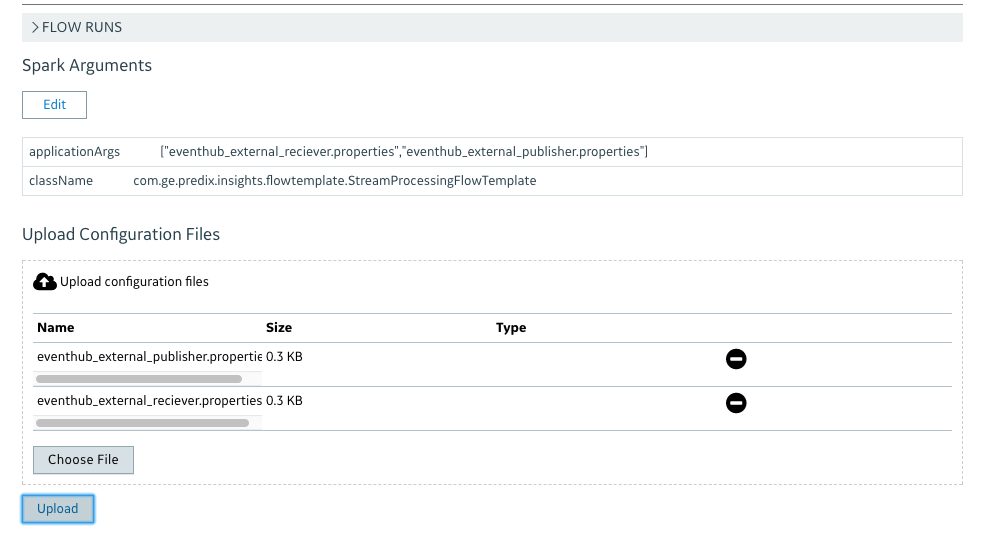

# Apache Spark: Event Hub Streaming Flow Template Prototype


## Overview
Event Hub Streaming Flow Template Prototype using the event hub connector as connecting to the event-hub, process the streaming data on the flight in pre-define time period window.

## Use Case 
The following 2 standard flow-templates that help to jump-start working toward event-hub  connector: 
1. Print FlowTemplate : This is the starting flow template, it receive the message data from event hub and print the message content to console window.
2. Stream Processing Flow Template: The flow template is used to process data from event hub. Apply for Spark Machine Learning (ML) and Deep Learning (DL).
See the Arch diagram in the Architecture for details.
 
 
## Event Hub Streaming Architecture

Event Hub Streaming application is designed to reveal the insight data from event hub as elaborated below:

***Batch Processing: Training Data*** Data is train using Spark ML library. Data got pull from TS/Blobstore for training and save to model back to Predix Blobstore, bellow is the Regression Pipeline model in Batch Training.
Flow iin snapshot bellow: 


***Stream Processing Data*** Streaming load the ML Model from Predix Blobstore. 
Streaming Flow using Event-Hub Connectors pull data from event-hub broker. Data go through cleaning/cleansing before cleansing dataframe feed to Pipeline prediction to genereate the prediction insight output.
Flow Diagram:
  


## Predix-Insight Setup: 
###Set up the predix insight job with flow template and flow 
***Setup Flow Template: Bellow is the sample of Predix Insight Flowtemplate

***Set up flow: Predix insight flow set up as bellow snapshot configuration.


## Usage:
1. **Building application**: I recommend starting with the print flow template, a simple basic java code.  

   1a.Start add the code in java class file : PrintFlowTemplate.java. For example, start make change under method: 
   ```
   public static void processMessage(Message message){
	  System.out.println("process message");
	  String messageFromEventHub = new String(message.getBody().toByteArray(), StandardCharsets.UTF_8); 
	  System.out.println(messageFromEventHub);
  	} 
   ```    
   1b.Build flow-template java app using maven command: mvn clean isntall    
   
2. **Running application on local/ native spark cluster**: 
   1b. Run locally using the command (see in the note:
     ```
       spark-submit --jars flow-template/lib/spark-streaming-event-hub-assembly-1.0.jar,flow-template/lib/hadoop-aws-2.7.4.jar,flow-template/lib/aws-java-sdk-1.7.4.jar --class com.ge.predix.insights.flowtemplate.StreamProcessingFlowTemplate spark-streaming-event-flow-template-1.0-SNAPSHOT.jar            
      
     ```
